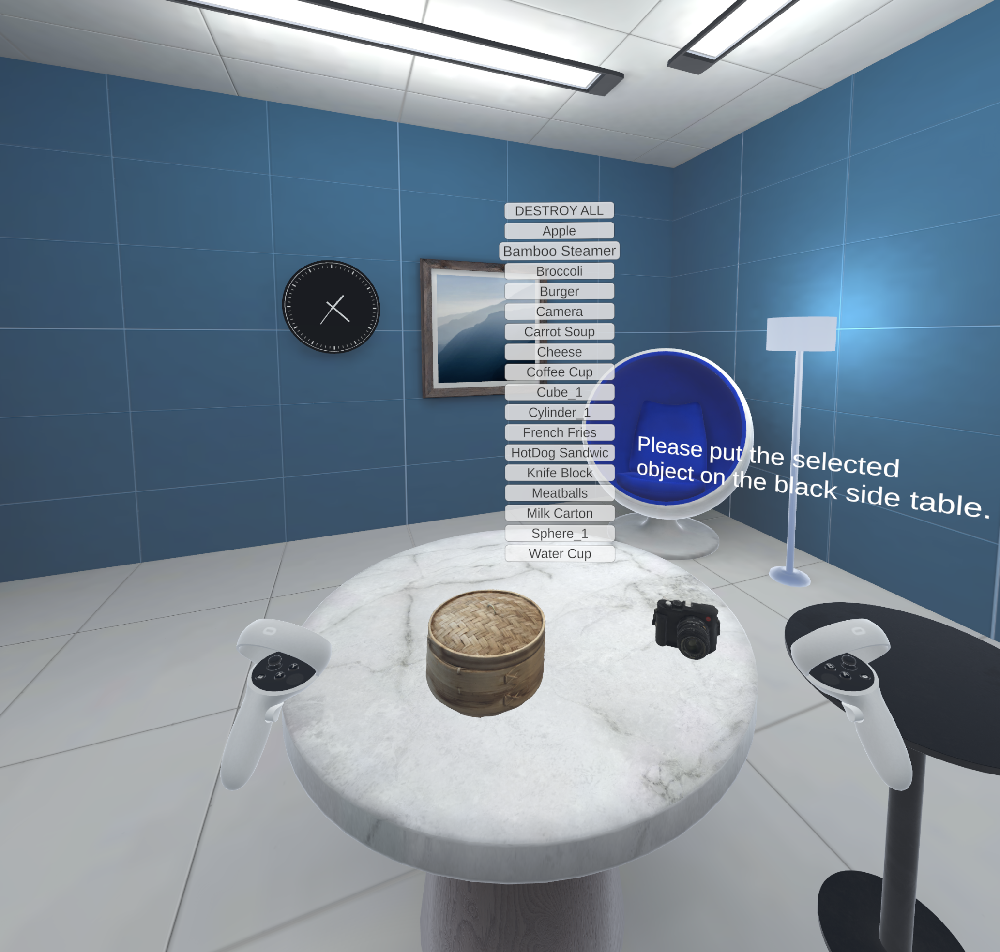

# UMD Smith School Marketing VR Research Project


## Overview
This project is developed for the Marketing Department of Robert H. Smith School of Business at the University of Maryland. This project focuses on XR interaction analytics in Unity, enabling users to interact with dynamically spawned objects in VR while capturing structured behavioral data such as grab frequency, interaction duration, and visual attention.

The system is designed for user behavior analysis, interaction research, and XR prototyping, with an emphasis on flexible data logging and extensibility.




## Main Features
- Dynamic Object Spawning
- XR Interaction Analytics
- View-Based Attention Tracking
- Structured Data Logging

## Project Structure
```
Assets/
├── Scenes/
│   ├── UserStudy.unity
│
├── Scripts/
│   ├── DataRecorder.cs
│   ├── InteractionLogger.cs
│   ├── ObjectSpawner.cs
│   ├── SelectorMenuBuilder.cs
│   ├── SelectorMenuInteractions.cs
│   ├── StatsDisplay.cs
│
├── Resources/
│   ├── SpawnableObjects/

```
## Requirements
- Unity 6.4 (project developed and tested on version 6000.4.1f1)
- Meta Interaction SDK
- Unity USD Importer package

## Setup Instructions 
1. Clone the repository:

```git clone https://github.com/DDXPP/Smith_School_Marketing_VR_Research_Project.git```

2. Open the project in Unity 6.4
3. Install required packages (via Package Manager):
    -   Meta XR SDKs
    -   USD Importer (if using USDZ assets)
    
    Detailed instructions on setting up Unity Editor and setting up Unity 3D Project can be found in [Meta Horizon documentation](https://developers.meta.com/horizon/documentation/unity/unity-tutorial-hello-vr/#step-2-set-up-your-unity-3d-project).   

4. Open `UserStudy` scene
5. Build and run on an connected XR device (project developed and tested on Meta Quest 2)

## Usage Guide
### Controller inputs
- `X` Button
    - Toggle stats display (show/hide)
- `Y` Button (Single Press)
    - Open object selection menu
    - Iterate through the objects
- `Y` Button (Long Press/Hold)
    - Confirm selection
    - Controller vibration confirms successful selection

### Spawnable Object Prep
To make an object spawnable in the project:
1. Place the prefab inside:

    ```Assets/Resources/SpawnableObjects/```


2. Ensure the prefab contains the following components:
    - `Mesh Renderer`
    - `Mesh Collider`

3. If importing a raw 3D model:
    - Drag the model into the scene
    - Configure components if needed (you may need to manually select the mesh in `Mesh Collider`)
    - Create a prefab from the model before placing it into the `SpawnableObjects` folder

### Spawn Objects and Clear the Scene
To spawn objects into the scene:
1. Press `Y` on the controller to open the object selection menu 
2. Use `Y` to find the object to be spawed
3. Hold `Y` to make the selection and spawn the selected object
4. Repeat step 1 to 3 to spawn more objects

To clear all the spawned objects in the scene:
1. Press `Y` on the controller to open the object selection menu 
2. Select `DESTROY ALL`
3. Hold `Y` to confirm

### Confirm Object Selection
Some user study would require participants to make a final selection of their preferred object after comparing a few objects. To do so, simply ask the participant to put their selected object on the black side table next to the main table. 

In the `.csv` file of the selected object, a column named `is_final_selection` would be marked `true`, and the time stamp when this value first becomes true would be the time when the participant makes their seleciton. 

### Export Logged Data
Logged data files are stored locally on the Meta Quest 2 at:

```/storage/emulated/0/Android/data/<your.package.name>/files/```

File name: `YYYYMMDD_HHMMSS_[object_name]_vr_data.csv`

You can access the files by:
- Connecting the headset to a computer via USB
- Using Android File Transfer tools
- Browsing the device storage directly
- For Mac users, please use tools like Android File Transfer

## Configurable Variables
Several important variables are exposed as public fields in the Unity inspector, allowing you to tune system behavior without modifying code. To configure the following variables, first click the GameObject `ObjectManager` in Unity's hierarchy window; then locate the component `Object Spawner (Script)` in the inspector where you can enter the desired values.

### Spawn Position
- Controls where objects are instantiated in the scene
- Default: above the table surface in the scene

### Samples Per Second
- Controls how frequently interaction data is collected
- Default: `10` samples per second

### Save Interval
- Controls how often collected data is written/saved
- Default: every `2` seconds

## Logged Data
Each object records (in `.csv` file):
- Date
- Time
- Runtime
- Object name
- Object position (`x, y, z`)
- Object rotation (`rx, ry, rz`)
- Camera/headset position (`cam_x, cam_y, cam_z`)
- Camera/headset rotation (`cam_rx, cam_ty, cam_rz`)
- Touch status
- Grab status
- Time to grab from touching
- Distance from touch to grab
- Grab events (`GrabStart, GrabEnd, TouchNoGrab`)
- Grab count
- Grab durations
- Hover without grab count (`touch_no_grab_count`)
- Viewing side
- Viewing angles in dot products:
    - `frontDot` 
    - `rightDot`
    - `upDot`
- Final selection (`is_final_selection`)


## Notes
The common sequence of events in two consecutive grabs would be `touch` → `grab` → `ungrab` → `untouch` → `touch` → `grab`. 

However, in the special case of `touch_1` → `grab_1` → (ungrab but still touching) → `touch_2` → `grab_2` (i.e., the second grab happens without the user moving their hand away or untouching the object), `time_to_grab` for `grab_2` would be `[timestamp_of_grab_2] - [timestamp_of_touch_1]`, which is equal to the sum of `time_to_grab` for `grab_1` and the time elasped between the two grabs.

<!-- ---
Keywords: XR, VR, Unity, Interaction Tracking, Data Logging, User Behavior Analytics -->